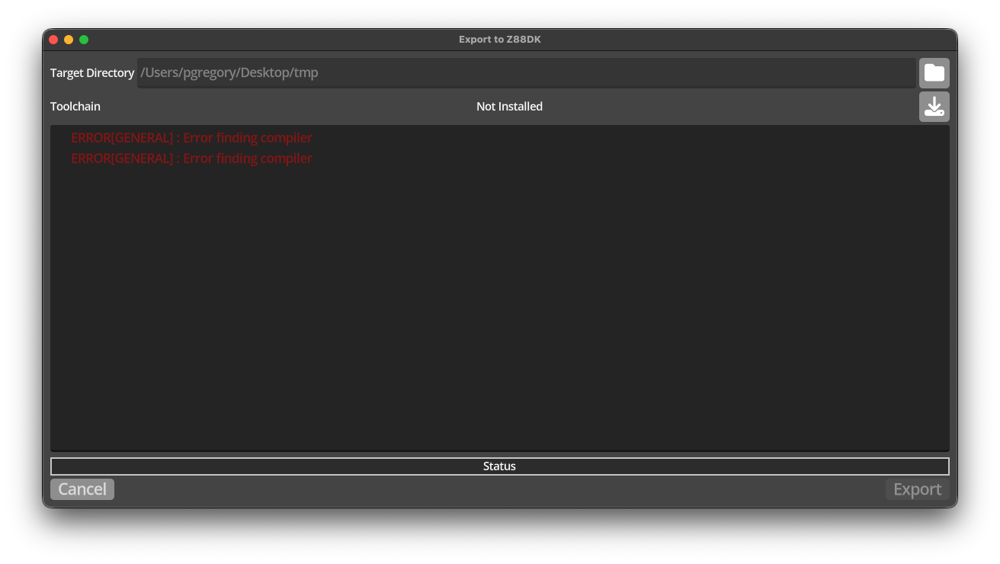
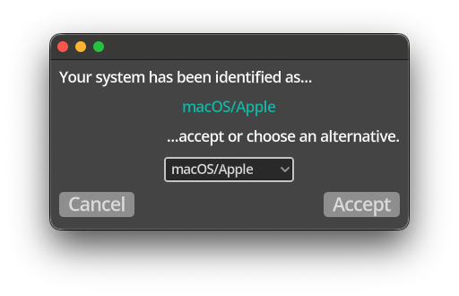
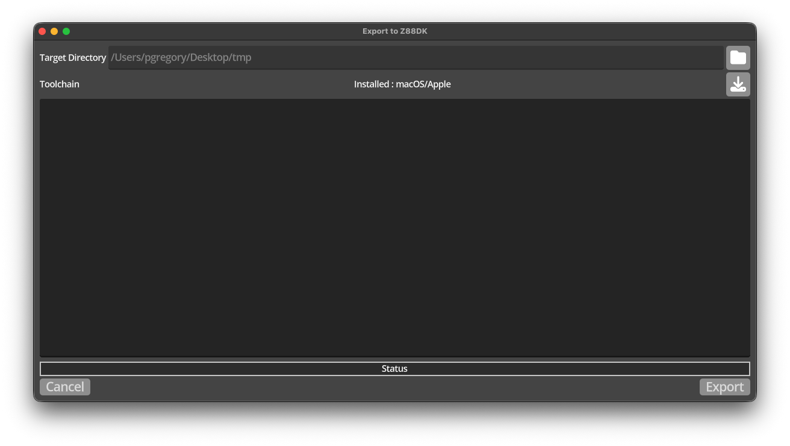

# Installation

Kwyll is distributed as a simple archive of the appropriate format for each 
platform, a .dmg for Apple macOS, and a .zip for Windows and Linux. The main
executable is contained within the archive. It is entirely self-contained,
no installation is required, simply run the executable, and copy it to 
your preferred location for applications.

## Export Toolchain

!!! note
    As of v0.1.0.9, Kwyll no longer requires the installation of a build
    toolchain, this section is left for anyone still using an earlier 
    version, but the recommendation is to update to the latest version
    for faster export, no dependencies, and more available memory.

The only additional requirement is the build toolchain, this is delivered
separately, it is based on a custom build of the z88dk compiler and is 
licensed under the same open source license as the z88dk project. Kwyll can
download and install the appropriate version of the toolchain for you. The 
version downloaded is significantly cut down from the installation of the
z88dk project itself, including only what is necessary to build a Kwyll 
game. To install the toolchain, open the 'Export' dialog by selecting the 
export button in the toolbar, or the 'Export-->Export Game' menu option. The
first time you do this, the dialog will indicate that no toolchain is found, as
shown below.

If you select the download button to the right of the Toolchain row, 
{align=right width=10%}
Kwyll will display the system it thinks you are running on.

If the identification is correct, simply accept the choice, or alternatively
select the correct system from the dropdown to override the identification.

Once accepted, Kwyll will download the correct toolchain and install it into
the application folder for Kwyll, which differs by operating system.

macOS
: `~/Library/Application Support/Godot/app_userdata/Kwyll`

Windows
: `%APPDATA%\Godot\app_userdata\Godot\Kwyll`

Linux
: `~/.local/share/godot/app_userdata/Kwyll`

Once installed, the export dialog should change to show the succcessful installation
of the toolchain, and allow you to export your Kwyll game.

