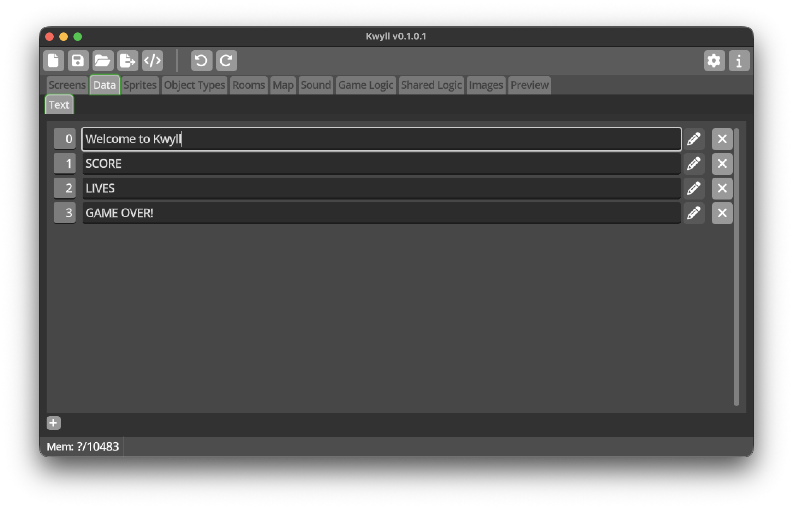

# Data Editor

The *Data Editor* is where you can define text strings to be used in your game.
The use of text strings is restricted to the
[Instruments](../introduction/terminology.md#instruments) on a screen. To the
left of a each string in the list is a number, this is the number to assign to
the *Value* of a text instrument to display this string, or to use in the __Set
Instrument Value__ node in logic.

The *Data Editor* is simple, in the toolbar below the list is a single button to
create a new string. In the list, each string is represented by a row, with the
first column being the index, used to display the string, the string contents follow,
and a button to delete the string.

!!! note
    The edit button is currently not operational, reserved for future functionality.
