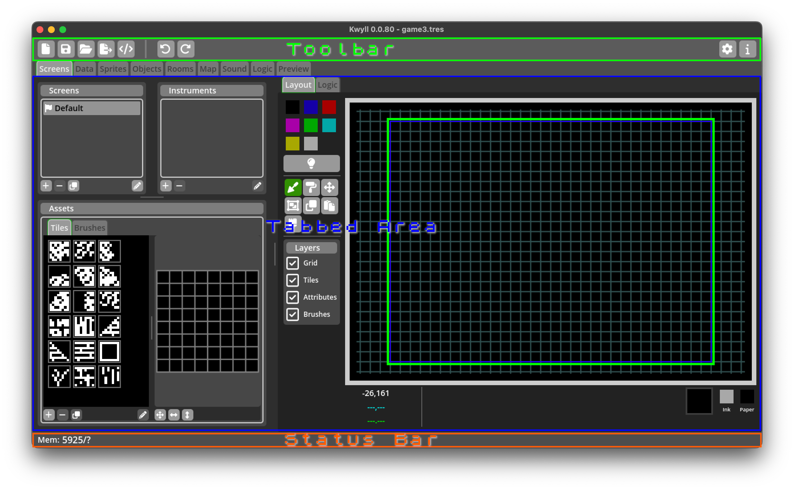
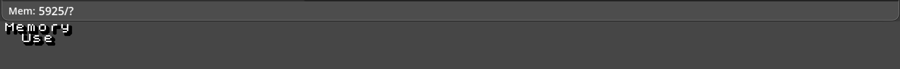

# The Kwyll Interface

/// figure-caption
    attrs: {id: main-interface}
Main Interface
///

The main interface of Kwyll consists of a single window with a menu, toolbar, a
tabbed main area and status bar. The menu is not shown in [Main
Interface](#main-interface), it is an operating system menu and as such on macOS
displays at the top of the screen as per operating system guidelines, on Windows
and Linux it may show at the top of the window above the toolbar.

## Toolbar

The toolbar contains shortcuts to commonly used functionality provided by the 
menu functions, in order from left to right:

{width="32px"} New Game 
: Clear the current game and start a new empty game.

{width="32px"} Save Game 
: Save the current game.

{width="32px"} Load Game
: Load an existing game, replacing the currently open one.

{width="32px"} Export Game
: Export the current game and build for running on a device or emulator.

{width="32px"} Review Export
: Display a breakdown of the exported project for review, showing important
  information such as how much memory is used by different parts of the game.

{width="32px"} Undo
: Undo the last action taken. Kwyll keeps a list of all actions taken up to
  the current point, allowing you to step back in history to undo changes made
  or redo them. Once any number of undo steps are taken and a new change is made
  the changes that could be redone are cleared and it no longer becomes possible
  to redo from that point.

{width="32px"} Redo
: Redo the last action undone. 

{width="32px"} Settings
: Edit game settings. 

{width="32px"} Information
: Show information about the version and status of your Kwyll installation. 

## Tabbed Area

The main body of the Kwyll window is taken up by the tabbed area. Each editor that
Kwyll has is in a separate tab in this area, including [Screen](./screen_editor.md),
[Data](./data_editor.md), [Sprites](./sprite_editor.md), [Objects](./object_editor.md),
[Rooms](./room_editor.md), [Map](./map_editor.md), [Sound](./sound_editor.md),
[Logic](./logic_editor.md) and [Preview](./preview.md).

## Status Bar

The status bar at the very bottom of the window is used to provide information
about the game to the designer such as memory use.

Memory Use
: Shows how much memory, in bytes, the game data currently uses out of how much
  is available for use. If the usage exceeds the available space, the game will not work
  on device or emulator.
