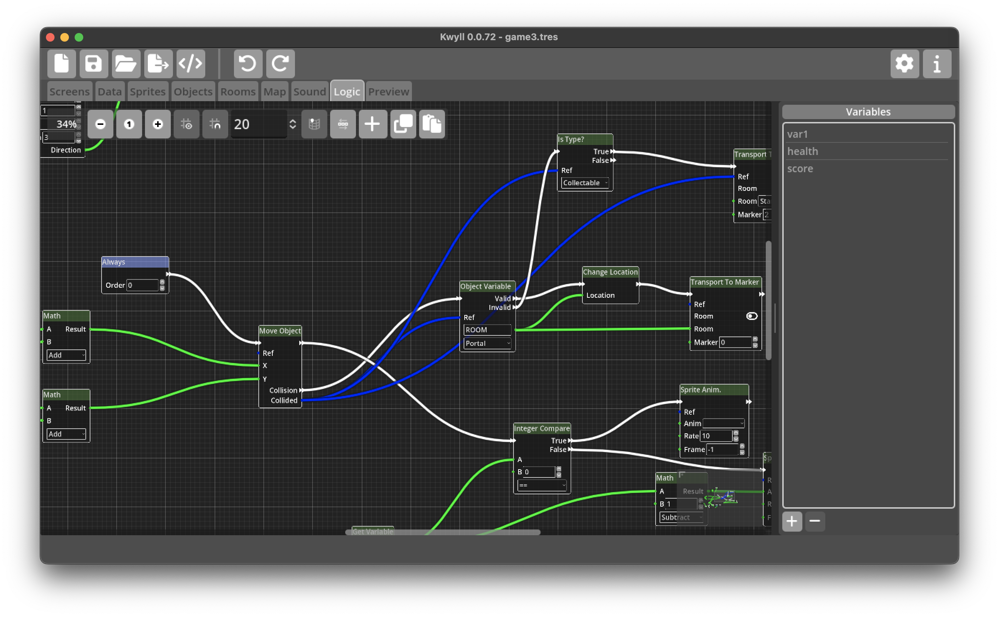

# Logic Editor

## Editing Nodes

*Nodes* are created by right clicking the mouse in an empty area of the grid, a
pop-up menu will appear with a list of all the possible *Node* types. When one
is selected it will appear in the graph at the mouse position. 

Click and drag on *Nodes* to move them around the graph and organise your
program. You can ++ctrl++/++cmd++ click on multiple *Nodes* to select more than
one at a time, or click and drag in space on the grid to drag a rectangle
around a selection of *Nodes*.

{align=left} To connect *Ports*
left click on one of the two *Ports* and drag, a wire will appear connected to
the *Port* you clicked on and the mouse. Drag the mouse to the other *Port* and
when you get close enough, it will snap to the *Port*, release the mouse to
complete the connection. If you struggle to begin the connection operation
because the port is too small, it can sometimes be helpful to zoom in, this can
be achieved using the mouse wheel or pinch gesture. *Ports* can be connected in
either direction, it makes no difference to the way they work, data only flows
from output to input.

To disconnect a port, click on the input end of the wire, the end going into
the input port of a *Node*, drag it away from the port and it'll disconnect,
you can reconnect to another port while still holding the mouse, or release the
mouse with the wire disconnected to delete the wire altogether.

