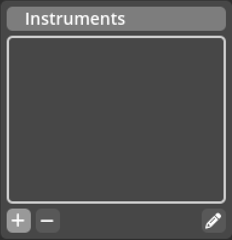
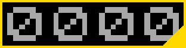

# Screen Editor

The *Screen Editor* is where in Kwyll you get to create and modify
[Screens](../introduction/terminology.md#screens). It is organised into
four main areas, the Screens List,
the Instruments List, the 
Assets Panel and the
Main Area.

## The Screens List

{align=left width="30%"}

This is where you can select, add and remove the various
[screens](../introduction/terminology.md#screens) that you have in your game.
The local toolbar below the list includes buttons to create a new screen,
delete the currently selected screen, and duplicate the currently selected
screen, to the left side. It also has a button to edit the screen properties to
the right. 

 

### Screen Properties

{align=right width="30%"}

The *Screen Properties* dialog is shown when double clicking a screen in the
screens list, or clicking the screen properties button. This is where you can 
modify various properties of the currently selected screen that are not editable
in the main area layout and logic tabs.

Name
: The name of the screen. This is used in logic for example when selecting to 
  switch to a different screen, the [Switch Screen](../logic/nodes/switch_screen.md)
  node will list the screen names in a dropdown control to make it easy to select
  which screen to switch to.

Game Screen?
: This toggles whether the screen should contain the game window or not. Typically
  only one screen in your game will have the game window included, but it is 
  possible to have it in multiple screens, even in different places on the screen.
  Some screens, such as a menu screen, a help screen, etc. will not require the
  game window to be shown, they will consist entirely of instruments.

Start Screen?
: This toggles if the screen should be the initial screen visible when starting 
  your game. Only one screen can have this flag set, so selecting it here will
  automatically clear it on all other screens. The start screen is also shown in 
  the [Screens List](#the-screens-list) with a flag icon.

Ink, Paper and Bright
: These combined set the default colours for the current screen. Instruments
  can override these values. The paper colour is used as the background to the
  entire screen. These values are also used as the default colours for tiles in
  the screen tilemap unless replaced by painting attributes in the tilemap, or by
  assigning colours to tiles.

 

## The Instruments List

{align=left width="30%"}

This is where you can select, add and remove the various
[Instruments](../introduction/terminology.md#instruments) defined in the
currently selected screen. The local toolbar below the list includes buttons to
create a new instrument and delete the currently selected instrument, to the
left side. It also has a button to edit the instrument properties to the right. 

 

{align=right width="30%"}

The *Instrument Properties* dialog is shown when double clicking on an instrument or
clicking the instrument properties button. This is where you can modify the various 
properties of an instrument.

Name
: The name of the instrument. This is used in logic for example when selecting to 
  update an instrument value, the [Set Instrument](../logic/nodes/set_instrument_value.md)
  node will list the instrument names in a dropdown control to make it easy to select
  which instrument to update.

Position:
: This is the position on the screen for the top left corner of the instrument. 
  Instruments are placed on a grid of cells, each 8x8 pixels in size, so on the 
  Spectrum, the range of these values are 0 to 31 in X and 0 to 23 in Y, any values
  beyond this range will result in the instrument being at least partially off screen.

Size
: The size in cells of the instrument, as with the position, the instrument size is
  specified in terms of cells, each 8x8 pixels in size.

Type
: The type of the instrument. An instrument will display its Value in 
  different ways depending on the type of instrument. A text instrument will display
  a string from the strings list, an integer instrument will display a numerical 
  value, and a tile instrument will show a single tile from the tileset.

Value
: The initial value of the instrument, the meaning of the value depends on the
  instrument type.

Color
: These controls allow you to override the default colour information defined by the
  screen. Ink and paper can be specified separately or ignored, choosing the black 
  colour with an "X" indicates that the instrument should not change the default for 
  ink or colour and instead use the value specified in the screen. The brightness value 
  can on or off, only if one of ink or paper is specified.

 

## Assets Panel

{align=left width="30%"}

The *Assets Panel* provides access to assets that can be placed in the screen editor
view in addition to [Instruments](../introduction/terminology.md#instruments). It is a
common element used in more than one editor in Kwyll, and as such has its ow separate 
section of the documentation [here](./assets_panel.md). 

 

## Main Area

{align=left width="60%"}

The rest of the *Screen Editor* is taken up with the main area, where the
majority of the editing of a [Screen](../introduction/terminology.md#screens)
takes place. It consists of two tabs, Layout and Logic. The Logic tab is a
standard [Logic Editor](./logic_editor.md) component that is used to edit logic
that applies to the current room, see
[Logic](../introduction/terminology.md#logic) for more details.

The Layout tab contains the screen layout editing tools. It consists of two parts, a 
standard [Tilemap Editor](./tilemap_editor.md) component, and layered on top of it a
specific set of editing features for Screens. The Tilemap Editor is documented 
separately as a common component.

### Layout

The screen *Layout Editor* works as a set of additional tools that operate in
the same space as the *Tilemap Editor*. It provides visual tools for
interactively placing screen elements such as
[Instruments](../introduction/terminology.md#instruments) and the *Game
Window*.

An [Instrument](../introduction/terminology.md#instruments) is represented on the 
grid as a yellow rectangle with a small triangle in the bottom right corner
{width="100px"}. You can click and drag the
instrument on the grid, it will automatically conform to the grid cells, snapping
to 8x8 increments. By carefully clicking on the small triangle in the corner, you can
drag out the rectangle to change its size, again, it will automatically conform to 
the grid.

If the screen being edited has the *Game Screen* flag set in the
[properties](#screen-properties), a blue rectangle will show to represent the
*Game Window*. This element does not have a resize handle (triangle), as it's
not possible to resize the game window in a screen, the game window size is
fixed on all screens, the only way to modify the game window size is in the
[Settings](./settings.md) dialog. However, the game window can be positioned
independently on each screen it is used, so dragging the blue rectangle
representing the game window works in much the same way as an *Instrument*, it
will also conform to the grid as appropriate. 

 
