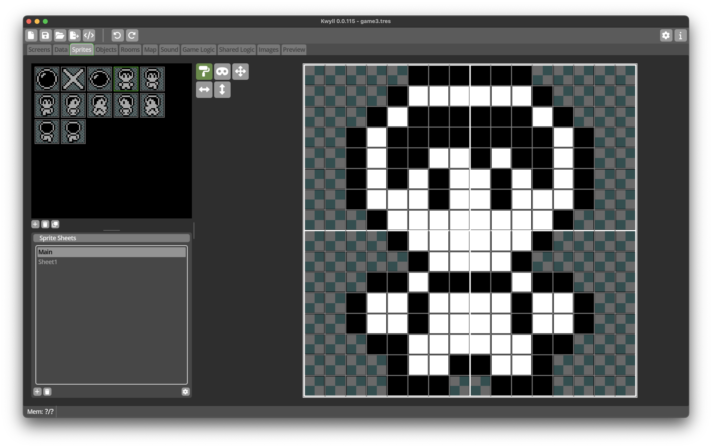

# Sprite Editor

The *Sprite Editor* is where you create your graphical masterpieces for use in
your Kwyll game. It consists of three main areas, the Sprite List, the Sprite Sheets
list, and the Bitmap Editor.

## Sprite List

This section shows a thumbnail list of all the sprites in the currently selected
sheet. It has buttons in the toolbar below to create a new sprite in the selected
list, delete the currently selected sprite, and duplicate the currently selected
sprite.

## Sprite Sheets

This section lists the different sprite sheets defined in your game. Each sheet
has a fixed size for the sprites in it, so if you need different sized sprites in
your game, you'll need to create multiple sheets. The toolbar below the list has
buttons on the left to create a new sheet, and delete the currently selected sheet,
as well as a button to edit the sprite sheet properties to the right.

 

### Sprite Sheet Properties

{align=right width=50%}

The *Sprite Sheet Properties* dialog allows you to edit various properties of the selected
sprite sheet. 

Sheet Name
: The name of the sprite sheet, give it a meaningful name to make your life easier.

Sprite Size
: The width and height of the sprites in this sheet, in increments of 8 pixels in each 
  direction, up to 32x32.

Flags
: The "Mask" flag defines whether the sprites in this sprite sheet can have a mask defined.
  This is used when the sprite is to be drawn using the "MASK" mode. If the sprites in a 
  particular sheet are only going to be drawn using "LOAD", "OR", or "XOR" mode, disable this
  flag to reduce wasted memory. See [Sprites](../introduction/objects/sprites.md#draw_modes) for more
  information about draw modes.

## Bitmap Editor

This is where you draw your __Sprite__ images. It has a simple set of tools in the toolbox area, and
a pixel grid that is the correct size for the selected __Sprite__.

{align=left width=10%}
{align=left width=10%}
The two main tools, the paint roller and the mask, define which type of pixels you draw or delete. If
the paint roller is selected, the left button paints a pixel, the right deletes it. If the mask tools
is selected, the left button draws a mask pixel, which is shown as a grey/teal checker pattern, and the
right button deletes the mask pixel. The area in the bitmap which is displayed with the checker pattern
is where the background pixels will show through.

 

The remaining tools are, in order, left to right, top to bottom:

Move
: {align=left width=10%}
  Selecting this tool and dragging on the bitmap will move the pixels and mask pixels, wrapping around 
  when they go off an edge of the grid.

 

Mirror
: {align=left width=10%}
  This is not a mode tool, it has an immediate effect when clicked, it will flip the pixels and mask of
  the __Sprite__ in the horizontal direction.

 

Flip
: {align=left width=10%}
  This is also an immedate effect tool, when clicked it will flip the pixels and mask of the __Sprite__
  in the vertical direction.

 
