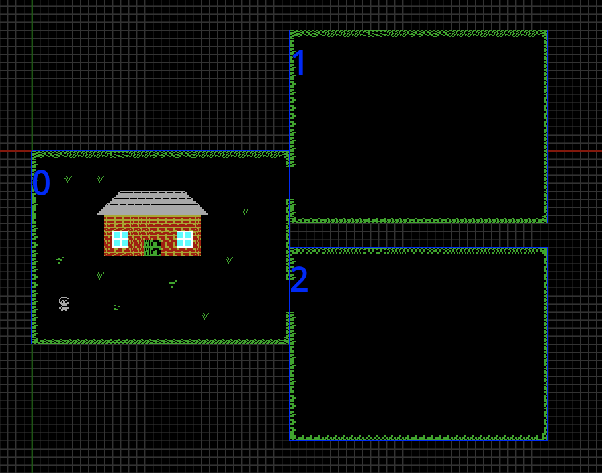

# Map

The *Map* is where you place *Room Types* and arrange them to create your
game's map. In the [Map Editor](../../interface/map_editor.md), you can drag
*Room Types* from the asset list to drop them into place on the map, this
creates a [Location](../terminology.md#locations) on the *Map*. How you arrange
your locations on the *Map* depends on the type of game you're creating. In
some games, the arrangement of [locations](../terminology.md#locations) on the
*Map* is not important, the Kwyll [logic](../terminology.md#logic) can be used
to move from location to location depending on other things, such as
interaction with an object like a doorway. In other games, if a player exits
the game window in one of the 4 possible directions, it is expected that they
change to the location in that direction on the *Map*. This is facilitated by
the *Player* flag on [Object Instances](../terminology.md#object-instances). If
an object has the *Player* flag set, when it exits the game window for any
reason, Kwyll will check automatically if there is another location in that
direction and move the game to that location. In this example, it's important
that the locations are placed accurately so that they connect. 

It's important to note that, while the locations must be connected carefully
they do not have to perfectly align into a grid. As long as there is a location
on the map at the place where the player exits one location and enters another
it will work, for example, a staggered alignment such as below, will work fine.

{width="50%"}

 
