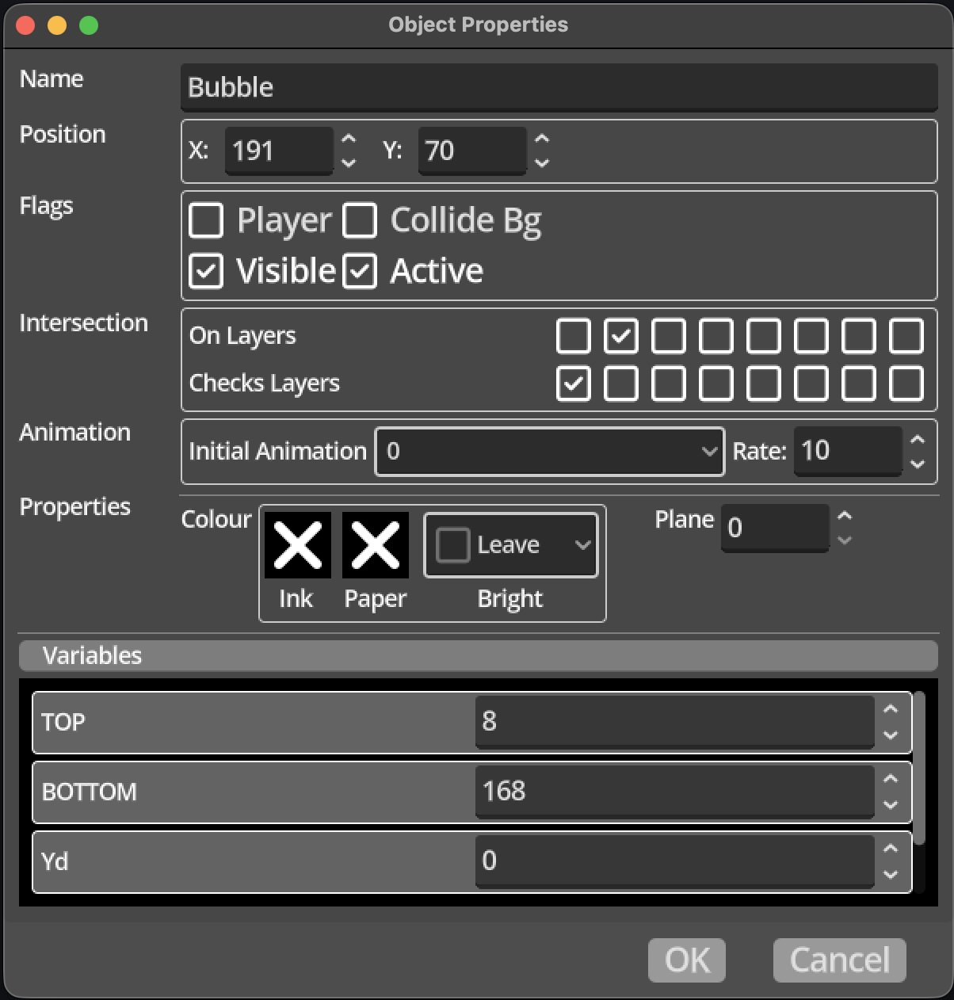

# Object Instances

An *Object Type* does not contribute to the game iself, it has to be used.
Object instances can be created in Rooms and the Map, each instance shares the
visual representation and logic code from the *Object Type*, but each use has
its own position, values for the variables defined in the logic, [Timeline
Animations](../terminology.md#timeline-animation), flags, and any other
information that might be specific to a particular platform. 

Changing a variable value in object [logic](../terminology.md#logic) changes
the value on the particular instance of that object that is running the logic.
For example, imagine you have an *Object Type* "Enemy" with some logic that
includes a variable "health" and in the logic for that *Object Type* you reduce
the health variable value each time it is hit by a missile from the player. If
you create two instances of that *Object Type*, each instance will have its own
value for the "health" variable, when a missile hits the first enemy object,
and the shared logic executes and reduces the "health" of the enemy, it is
modifying only the value stored on the first instance, the value on the second
enemy is not changed. Similarly, when a missile hits the second enemy, its
health value is reduced, and the health of the first enemy is not changed.

Objects can be used in the following ways.

 - Map Objects - these are created in the [Map
   Editor](../../interface/map_editor.md) and are constant throughout the game,
   they will always exist independent of which
   [Location](../terminology.md#locations) is shown, and will be drawn, if
   their position puts them on screen, and their logic will be run, if they are
   flagged as "Active".
 - Room Objects - these are in each [Room Type](../terminology.md#room-types),
   created in the [Room Editor](../../interface/room_editor.md), and will only
   be visible and active while in a [Location](../terminology.md#locations)
   that uses that __Room__, so they will not be drawn or their logic run when
   in location that uses another room. It's worth noting that when exiting a
   room that contains Room Objects, the data used by the Kwyll library for
   those objects, such as memory for [Sprite](../terminology.md#sprites) etc.
   will be freed, reducing the overhead for both memory and performance, so it
   is advisable to use Room Objects where appropriate over Map Objects.
 - Dynamic Objects - these are not created in an editor during your game
   creation, they are instead created during the game using the [Spawn
   Object](../../logic/nodes/spawn_object.md) node, and can be destroyed using
   the [Kill Object](../../logic/nodes/kill_object.md) node. They are in all
   other respects similar to Global Objects, they are not constrained to a
   particular [Room Type](../terminology.md#room-types), and will continue to
   exist across changes in [Location](../terminology.md#locations) until they
   are destroyed.

### Object Properties

{align=left width="50%"}

Each object instance has a number of properties that influence how the object
works in the game. These properties are unique to each object instance, unlike
the shared properties that all instances of a particuler [Object
Type](../terminology.md#object-types) have such as sprite animations and logic.

 

 - Position - the position of the object as an X and Y coordinate, with X
   being the horizontal axis and Y the vertical. Where this places the object
   depends on the type of object instance. A Global or Dynamic object will have
   coordinates that represent a position on the Map, while Room objects will 
   have coordinates that represent a position within the room, irrespective of
   which location and where that location is on the Map. This must be considered
   when using logic to change the position of objects, and to check things like
   which tile is at a location related to an object.
 - Flags - used to define the behaviour of the object.
    - Player - if the player flag is checked, the object will check if it is off
     screen as it is moved, and if so, whether to move to a new location on the 
     Map. This is useful to make it simple to implement a game where rooms 
     connect perfectly on the Map, and moving out of one location should naturally
     result in moving to the neighbouring location, without having to manually
     switch location in logic.
    - Collide Bg - if this flag is checked, the object will be checked against the 
      collision information assigned to each tile in the tile map. If a tile's
      collision information indicates an object cannot pass through a side, the
      object will be prevented from doing so.
    - Visible - if this flag is checked, the object's sprite will be drawn if it is
      on screen. If it is cleared, it will not be drawn, but it will still interact
      with other objects, and it's logic will still operate.
    - Active - if this flag is checked, the object will be considered when
      checking if objects intersect and whether the [Object
      Hit](../../logic/nodes/object_hit.md) trigger is fired when they do. If
      the flag is checked any logic flows on the [Object
      Type](../terminology.md#object-types) will be run as appropriate.
 - Intersection - Kwyll can check if objects are touching or intersecting each other
   and trigger logic when they do. In order to control how much work is done to
   do this checking, Kwyll implements a layering system for objects. Careful use of
   this is imperative to limit the performance impact of intersection testing. The 
   layering system works by which layer(s) an object is "on" against which layer(s)
   it checks for intersection, and only if they match is an intesection checked for
   and reacted to. When checking a pair of objects for intersection, Kwyll will only
   consider pairs where either object A is on a layer that object B is checking for,
   or object B is on a layer that object A is checking for. This gives a great deal of
   flexibility in limiting which things to check. For example, enemies can be be put
   on their own layer, and that layer is not included in their "checks" layer list, 
   which would mean Kwyll will never bother checking for intersections between two
   enemies.
     - On Layers - this defines which layer(s) the object is considered to exist on.
       An object can be on multiple layers, for example, you may decide that layer 2
       is for collectibles, and layer 3 is for things that hurt enemies. An object can
       be placed on both, meaning the player can collect it, and if an enemy object
       touches it, it can be hurt.
     - Checks Layers - this defines which other layers to check for intersection with
       only if an object exists on one of the layers defined here will Kwyll consider
       checking for an intersection.
 - Animation - these properties control the sprite animation of the object. If
   an [Object Type](../terminology.md#object-types) has animations configured,
   you can choose which animation is playing by default, and at what rate. The
   rate is defined as the number of game frames between changes in a sprite
   frame. So, if the game is running at 50 frames per second, and the rate is
   set at 25, it will animate at 2 frames per second, waiting 25 out of 50
   frames between each update.
 - Properties - this section contains properties that are specific to each platform,
   such as colour and plane. They are described in the platform specifics section of
   this manual.
 - Variables - this area a will show a list of the variable names that are
   defined on the [Object Type](../terminology.md#object-types) for this object
   instance. It allows you to set the values of those variables at the start of
   the game. This is particularly useful to enable configuration of objects
   that share a common type, but have specific behaviour per instance. For
   example, an enemy object might have logic that makes it patrol horizontally
   or vertically between two points in the room. Defining variables to indicate
   which direction and the minimum and maximum position in that axis means you
   can easily set those per instance to create variations of an enemy type very
   efficiently.
