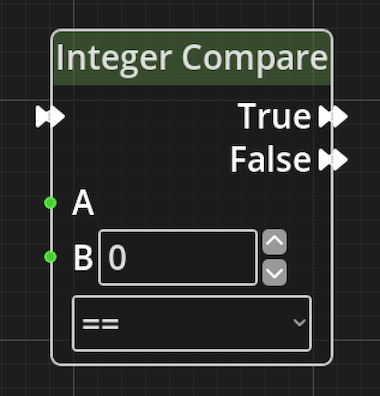
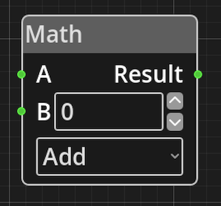
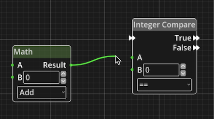

# What is Logic in Kwyll?

One of the most important aspects of a game created with Kwyll is the
ability to make objects, and other things, "do stuff", this is achieved
with the logic system that is built into Kwyll. It is akin to the
programming language in other game creation tools, but instead of being
text based, it is visual, working by wiring together small items that do
a relatively simple thing so that the whole does something more
interesting. 

These "small items" are called *Nodes*, Kwyll provides a basic set of
*Nodes* that can be combined to do a variety of things, the process of
"wiring" them together enables each *Node* to either pass data to another
node, or to control the flow of the "program". Some of the *Nodes* are
very simple, such as the *Math Node*, whose only job is to take in two
values, perform a basic mathematical operation on them, add, subtract,
multiply or divide, and then output the result. Others are more complex
and perform a detailed operation in and of themselves based on the input
and parameters.

Each node as an optional set of input and output *Ports* which can be
of different types depending on their purpose, and a set of
*Parameters* which configure the operation of the *Node*.

{ align=left } This is a
relatively simple *Node* that demonstrates most of the key features of a
logic Node. Here you can see on the left of the *Node*; 3 input *Ports*,
one with a double arrow at the top, and two green ones below. The double
arrow port is a *Flow* port, it is connected to other ports of the same
type to control the flow of execution. A *Node* will only have at most 1
*Flow* input ports. The green ports are data inputs, they provide
integer numerical values to the node from some other node. You'll notice
that the "B" *Port* also has a numerical input field alongside it, this
is because in this particular case the value that the *Node* uses can
either be provided by another node via the *Port* or specified as a
fixed value. In this example, you may want to compare the input from
another *Node* at A with either an input from another *Node* or with 0
for example. If you connect another *Node* to the input *Port* B, the
numerical input field will be hidden as it is no longer necessary. On
the right of the *Node* are the output ports, in this example there are
two *Flow Ports*, True and False. This *Node* is a "branching" node, it
will perform a comparison of the two values A and B using the specified
comparison type, for example "equal". If the comparison results in a
positive result, i.e. the two values are equal, the flow will follow
whatever is connected to the True output *Port*, if anything. If the
comparison is negative, A and B are not equal, the flow will follow the
False output *Port*. Below the B port is a *Parameter*, in this case it
is the type of comparison to be made between A and B, equal, greater
than, less than, etc. A *Parameter* can be identified by the lack of any
input or output ports. It is a means of configuring the operation of a
*Node* in a way that doesn't require input from another *Node*. To
summarise, on this *Node* A is a *Port* only, it requires an input wire
to work, B is an input *Port* __or__ *Parameter* you can choose how this
value is set depeneding upon your needs, and the comparison type is a
*Parameter*, you must choose this value when editing and it cannot
change at runtime.

{align=right} Some nodes will have
no *Flow* ports at all, this means the *Node* is not meant to be part of
the flow, but instead is meant to provide data to other nodes that are
part of the flow. These *Nodes* will have output data *Ports* that can
be connected to the input data *Ports* of other *Nodes*, when a *Node*
that is part of a flow has a wire connecting one of its input *Ports* to
the output *Port* of another *Node*, it will request the value from the
other *Node* when it needs it.

*Nodes* that are in a logic graph but not connected to a valid *Flow* or
have output *Ports* that are not connected to anything, will not
contribute to the program and will not be exported.

There are currently two types of data port in Kwyll's logic, integer
numerical, indicated by a green colour and connected by a green wire,
and object reference, indicated by a blue colour and connected by a blue
wire. It is only possible to connect two ports of the same type to one
another, be that a *Flow* port or a type of data *Port*.

## Editing Nodes

In the logic editor, *Nodes* are created by right clicking the mouse in
an empty area of the grid, a pop-up menu will appear with a list of all
the possible *Node* types. When one is selected it will appear in the
graph at the mouse position. There is one more way to create *Nodes* via
the variable list, which will be covered when that section of the logic
editor is detailed.

Click and drag on *Nodes* to move them around the graph and organise
your program. You can ++ctrl++/++cmd++ click on multiple *Nodes* to
select more than one at a time, or click and drag in space on the grid
to drag a rectangle around a selection of *Nodes*.

{align=left} To connect
*Ports* left click on one of the two *Ports* and drag, a wire will
appear connected to the *Port* you clicked on and the mouse. Drag the
mouse to the other *Port* and when you get close enough, it will snap to
the *Port*, release the mouse to complete the connection. If you
struggle to begin the connection operation because the port is too
small, it can sometimes be helpful to zoom in, this can be achieved
using the mouse wheel or pinch gesture. *Ports* can be connected in
either direction, it makes no difference to the way they work, data only
flows from output to input.

To disconnect a port, click on the input end of the wire, the end going
into the input port of a *Node*, drag it away from the port and it'll
disconnect, you can reconnect to another port while still holding the
mouse, or release the mouse with the wire disconnected to delete the
wire altogether.
