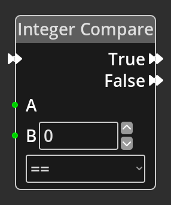

# What is Logic in Kwyll?

One of the most important aspects of a game created with Kwyll is the
ability to make objects, and other things, "do stuff", this is achieved
with the logic system that is built into Kwyll. It is akin to the
programming language in other game creation tools, but instead of being
text based, it is visual, working by wiring together small items that do
a relatively simple thing so that the whole does something more
interesting. 

These "small items" are called *Nodes*, Kwyll provides a basic set of
*Nodes* that can be combined to do a variety of things, the process of
"wiring" them together enables each *Node* to either pass data to another
node, or to control the flow of the "program". Some of the *Nodes* are
very simple, such as the *Math Node*, whose only job is to take in two
values, perform a basic mathematical operation on them, add, subtract,
multiply or divide, and then output the result. Others are more complex
and perform a detailed operation in and of themselves based on the input
and parameters.

Each node has an optional set of input and output *Ports* which can be
of different types depending on their purpose, and a set of
*Parameters* which configure the operation of the *Node*.

{ align=left width="30%"} This 
is a relatively simple *Node* that demonstrates most of the key features of a
logic Node. Here you can see on the left of the *Node*; 3 input *Ports*, one
with a double arrow at the top, and two green ones below. The double arrow port
is a *Flow* port, it is connected to other ports of the same type to control
the flow of execution. A *Node* will only have at most 1 *Flow* input port. The
green ports are data inputs, they provide integer numerical values to the node
from some other node. You'll notice that the "B" *Port* also has a numerical
input field alongside it, this is a parameter, in this particular case the
value that the *Node* uses can either be provided by another node via the
*Port* or specified as a fixed value in the parameter. In this example, you may
want to compare the input from another *Node* at A with either an input from
another *Node* or with a specific fixed value, 0 in this case. If you connect
another *Node* to the input *Port* B, the numerical input field will be hidden
as it is no longer necessary. On the right of the *Node* are the output ports,
in this example there are two *Flow Ports*, True and False. This *Node* is a
"branching" node, it will perform a comparison of the two values A and B using
the specified comparison type, for example "equal". If the comparison results
in a true result, i.e. the two values are equal, the flow will follow whatever
is connected to the True output *Port*, if anything. If the comparison is
false, A and B are not equal, the flow will follow the False output *Port*.
Below the B port is another *Parameter*, in this case it is the type of
comparison to be made between A and B, equal, greater than, less than, etc.
This *Parameter* has no input port, so it can only have a fixed value chosen at
deisgn time. It is a means of configuring the operation of a *Node* in a way
that doesn't require input from another *Node*. To summarise, on this *Node* A
is a *Port* only, it requires an input wire to work, B is an input *Port*
__or__ *Parameter* you can choose how this value is set depeneding upon your
needs, and the comparison type is a *Parameter*, you must choose this value
when editing and it cannot change at runtime.

{align=right width="30%"} Some nodes
will have no *Flow* ports at all, this means the *Node* is not meant to be part
of the flow, but instead is meant to provide data to other nodes that are part
of the flow. These *Nodes* will have output data *Ports* that can be connected
to the input data *Ports* of other *Nodes*, when a *Node* that is part of a
flow has a wire connecting one of its input *Ports* to the output *Port* of
another *Node*, it will request the value from the other *Node* when it needs
it.

*Nodes* that are in a logic graph but not connected to a valid *Flow* or
have output *Ports* that are not connected to anything, will not
contribute to the program and will not be exported.

There are several types of data that can be passed between logic nodes in Kwyll, 
each with a unique colour for the port and wires that connect them.

Number
: Shown as green, a signed 16 bit integer value, 
  capable of representing anything between -32768 and 32767.

Object
: Shown as blue, a reference to an object in the 
  game, can be a Room object or a global object.

Location
: Shown as magenta, a reference to a location 
  on the map.

## Editing Nodes

See the [Logic Editor](../interface/logic_editor.md) for a detailed explanation
of the tools for creating and editing logic graphs in Kwyll.
