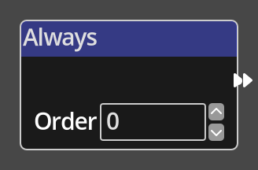

# Always

## Description

{align=left width="25%"}
The *Always Node* is a specific type of *Node* called a __Trigger__. A trigger
*Node* is an entrypoint into a flow in the Kwyll logic. The *Always* trigger is
the most commonly used trigger node, it will run the flow that follows on from
it's __Flow Out__ port every frame of the game.  

 

-------

## Ports

Flow Out
: As with all trigger nodes, an *Always Node* has only a single flow port
  on the output side. There is no input flow to a trigger node as it is
  the origin of a flow.

-------

## Parameters

Order 
: *Always Nodes* have a single additional parameter, __order__. This is
  used to define the order in which multiple *Always Nodes* in a single
  logic program will be processed, in case there is some dependency
  between flows. If there are multiple *Always Nodes* with the same order,
  they will be processed together in an arbitrary order.
