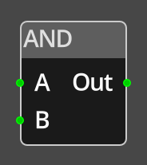

# And

## Description

{align=left width="25%"}
The *And Node* takes two inputs of type integer and performs either a logical
or bitwise AND operation on them before providing the result on the *Out* port.

If the *Logical* flag is set, the node will consider any non-zero value as "true" 
and 0 as false for both parameters, and output a 1 if both are true otherwise 0.

If the *Logical* flag is clear, the node will peform a bitwise AND on the two 
16 bit integer parameters, resulting in a 16 bit integer where each bit is set 
only if both parameters have that same bit set.

 

-------

## Ports

A and B
: The two input values, they must be linked for the node to be operational and
  can only be connected to sources that provide an integer value, such as
  [Get](get_variable.md).

Out  
: The output of the node.

-------

## Parameters

B 
: A constant integer value for the right operand, used when the __B__ port is not
  connected.

*Logical*
: This defines whether the AND is to be performed as a logical or bitwise AND. 
