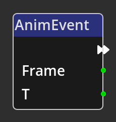

# Animation Event

{align=left}
The *Animation Event Node* is a specific type of *Node* called a __Trigger__. A
trigger *Node* is an entrypoint into a flow in the Kwyll logic. The *Animation
Event* trigger is connected to the timeline animation feature in the [Rooms
Editor](../../interface/room_editor.md). It will run the flow that follows on
from it's __Flow Out__ port when a the current timeline animation for this
object hits a keyframe that has the *Trigger Event* checkbox selected. The
__Frame__ and __T__ output ports provide the frame number of the keyframe in
the timeline, and the *T* value specified in the editor respectively.

 

-------

## Ports

Flow Out
: As with all trigger nodes, an *Animation Event Node* has only a single flow
  port on the output side. There is no input flow to a trigger node as it is the
  origin of a flow.

Frame
: An integer output port that provides the frame number of the triggering
  keyframe in the timeline.

T
: An integer output port that provides the *T* value set in the timeline editor,
  in the range 0-127.
