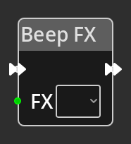

# Beep FX

## Description

{align=left} The *Beep FX
Node* is used to play a beeper sound effect defined in the Beep FX panel of the
[Sound Editor](../../interface/sound_editor.md). 

 

-------

## Ports

### Flow In

In order for this node to perform its operation, it must be connected into an
active flow using this input port. The flow will ultimately originate at a
__Trigger__ node but can come from the __Flow Out__ port of any other flow
node.

### Flow Out

A node connected to the __Flow Out__ port will be executed in sequence
following the completion of this node's operation.

### FX

An integer input port used to provide the index of the Beep FX sound effect in
the list as defined by the [Sound Editor](../../interface/sound_editor.md).

-------

## Parameters

### FX 

A dropdown selection of existing sound effects from the Beep FX tab of the
[Sound Editor](../../interface/sound_editor.md). Use this if you wish to
trigger a specific sound effect, use the port at the same level in the node if
you wish to trigger a sound effect based on some calculations elsewhere in the
logic graph.
