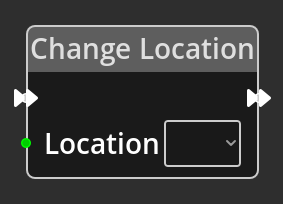

# Change Location

## Description

{align=left} The
*Change Location Node* is used to switch to another
[Location](../../introduction/terminology.md#locations) on the map. 

 

-------

## Ports

Flow In
: In order for this node to perform its operation, it must be connected into an
  active flow using this input port. The flow will ultimately originate at a
  __Trigger__ node but can come from the __Flow Out__ port of any other flow
  node.

Flow Out
: A node connected to the __Flow Out__ port will be executed in sequence
  following the completion of this node's operation.

Location
: An integer input port used to provide the index of the map location as defined
  in the [Map Editor](../../interface/map_editor.md).

-------

## Parameters

Location 
: A dropdown selection of existing location indices from the [Map
  Editor](../../interface/map_editor.md). Use this if you wish to change to a
  specific location, use the port at the same level in the node if you wish to
  use a location based on some calculations elsewhere in the logic graph.
