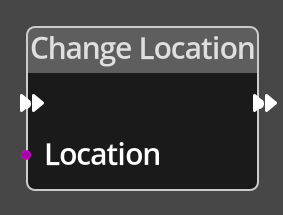

# Change Location

## Description

{align=left width="25%"}
The *Change Location Node* is used to switch to another
[Location](../../introduction/terminology.md#locations) on the map.

 

-------

## Ports

Flow In
: In order for this node to perform its operation, it must be connected into an
  active flow using this input port. The flow will ultimately originate at a
  __Trigger__ node but can come from the __Flow Out__ port of any other flow
  node.

Flow Out
: A node connected to the __Flow Out__ port will be executed in sequence
  following the completion of this node's operation.

Location
: A location reference input port that provides a reference to the location to
  change to.

