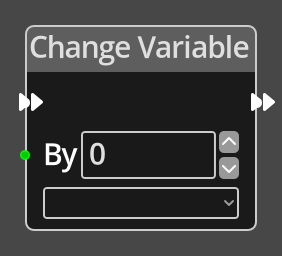

# Change Variable

## Description

{align=left width="25%"}
The *Change Variable Node* is a simple way to modify the value of a variable on the
current logic graph in one operation, avoiding the need for a
[Get](./get_variable.md), [Math](./math.md) and [Set](./set_variable.md)
sequence.

 
  
-------

## Ports

Flow In
: In order for this node to perform its operation, it must be connected into an
  active flow using this input port. The flow will ultimately originate at a
  __Trigger__ node but can come from the __Flow Out__ port of any other flow
  node.

Flow Out
: A node connected to the __Flow Out__ port will be executed in sequence
  following the completion of this node's operation.

By 
: An integer input port used to provide the amount that the variable will be 
  changed by, this can be positive or negative. 

Index
: An integer value for choosing which element in an Array variable to change. If the
  variable being accessed is not an Array variable, this parameter is ignored.

-------

## Parameters

By 
: A constant integer amount that the variable will be changed by, used when the 
  __By__ port is not connected.

*Variable*
: A dropdown listing the defined variables associated with the current logic graph.

Index
: A constant integer for the Array index if the __Index__ port is not connected.
