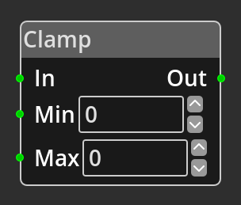

# Clamp

## Description

{align=left} The *Clamp Node*
takes an integer value on the __In__ port, if the value is less than or equal
to the __Min__ port/parameter the __Min__ port/parameter value is output, if it
is greater than or equal to the __Max__ port/parameter the __Max__
port/parameter value is output, otherwise the value is output unmodified. 

 
  
-------

## Ports

In 
: An integer input port used to provide the input value for testing. This must be
  connected for the node to operate correctly.

Out
: An integer output port, the result of the comparison detailed in the
  description is output on this port.

Min
: An integer input port, using this allows you to specify the minimum value from
  elsewhere in the logic graph, such as via an [Integer
  Constant](integer_constant.md) node.

Max
: An integer input port, using this allows you to specify the maximum value from
  elsewhere in the logic graph, such as via an [Integer
  Constant](integer_constant.md) node.

-------

## Parameters

Min 
: A constant integer value for the minimum, used when the __Min__ port is not
  connected.

Max 
: A constant integer value for the maximum, used when the __Max__ port is not
  connected.
