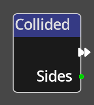
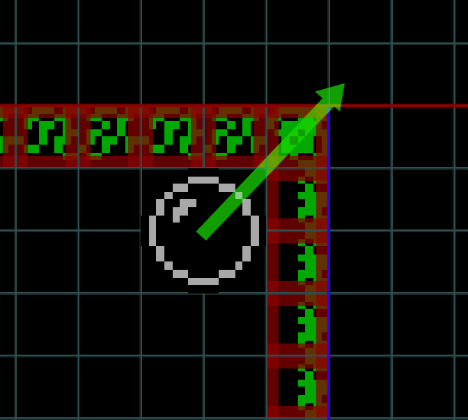

# Collided

## Description

{align=left width="25%"}
The *Collided Node* is a specific type of *Node* called a __Trigger__. A
trigger *Node* is an entrypoint into a flow in the Kwyll logic. The *Collided*
trigger will get triggered when the object it is on has collided with the 
tilemap as a result of being moved with a [Move Object](./move_object.md)
node.

 

-------

## Ports

Flow Out
: As with all trigger nodes, a *Collided Node* has only a single flow
  port on the output side. There is no input flow to a trigger node as it is the
  origin of a flow.

Sides
: An integer output port that provides the sides that the collision occurred. 
  Typically this will be a single side, but to accommodate the potential of 
  simultaneously colliding with two sides, the value is encoded as a bit field.
  That is, the first 4 bits of the binary representation encode the up, down,
  left and right sides. Bit 0 is up, bit 1, down, bit 2 left and bit 3 right. 

  An Example:
  {align=left width="25%"}
  In this image, the object is moving in the direction of the green arrow, which 
  will result in it colliding in both right and up directions, as the tilemap has
  collision information indicating that the tiles cannot be passed in all directions,
  the resulting value will be bit 0 set and bit 3 set, bit 0 set results in a
  value of 1, bit 3 set results in a value of 8, add them together and the output
  of the Sides port would be 9.

  Bits:

|     |  0  |  1  |  2  |  3  |
|-----|-----|-----|-----|-----|
|SIDE | UP  |DOWN |LEFT |RIGHT|
|VALUE|  1  |  2  |  4  |  8  |
