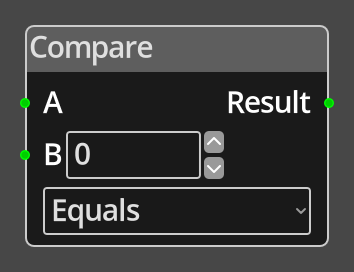

# Compare

## Description

{align=left width="25%"}
The *Compare Node* performs a comparison between two input values and 
returns 0 if the comparison is fails, or 1 if it succeeds. 

 
  
-------

## Ports

A 
: An integer input port used to provide the first value for comparison. 
  This must be connected for the node to operate correctly.

B
: An integer input port used to provide the second value for comparison.

Result
: The output of the comparison, either 0 if the comparison fails or
  1 if it succeeds.

-------

## Parameters

B
: A constant integer value for the B operand, used when the __B__ port is not
  connected.

Comparison
: The type of comparison to perform, this can be any one of "equals", 
  "greater than", "less than", "greater or equal", "less or equal", or
  "not equal".

