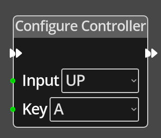

# Configure Controller

## Description

{align=left width="25%"}
The *Contfigure Controller Node* sets the key mapping for a specific controller
input to a new [Keycode](../../introduction/terminology.md#keycodes), thus
allowing the game designer to offer the ability for a player to set their own
keys for playing the game.

 

-------

## Ports

Flow In
: In order for this node to perform its operation, it must be connected into an
  active flow using this input port. The flow will ultimately originate at a
  __Trigger__ node but can come from the __Flow Out__ port of any other flow
  node.

Flow Out
: A node connected to the __Flow Out__ port will be executed in sequence
  following the completion of this node's operation.

Input
: The index of the controller input type to set the key mapping for:
  0 - UP, 1 - DOWN, 2 - LEFT, 3 - RIGHT, 4 - FIRE.

: Key
  The [Scancode](../../introduction/terminology.md#keycodes) of the key to assign
  to the controller input.

-------

## Parameters

Input 
: A dropdown list of the possible controller inputs to choose from in place of a 
  connection at the __Input__ port.

Key
: A dropdown list of all the [Scancodes](../../introduction/terminology.md#scancodes]
  to choose from in place of a connection at the __Key__ port. 

