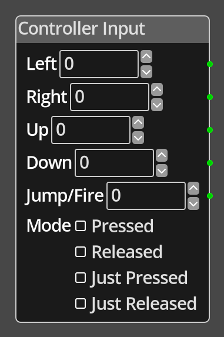

# Controller Input

## Description

{width="25%" align=left}
The *Controller Input Node* reports on the status of the configured controller
for left, right, up, down and jump/fire. This node will adapt to whatever has
been configured for the input method in your game, joystick, keyboard etc. The
node allows you to define which values to return when each input is activated,
defaulting to 1 for each, so that you can define the appropriate values for
your needs. For example, it might be common to use -1 for left and 1 for right,
to be used directly later in the graph as directions on the X axis to avoid
having to convert the input to a direction manually.

The controller reports the status in one of four modes, *Pressed*, *Released*,
*Just Pressed* and *Just Released*. The *Pressed* and *Released* modes will
report continuously while the input is in the appropriate state, either pressed
or not pressed. The *Just Pressed* and *Just Released* will report only for the
frame after the input changes to the appropriate state, pressed or released.
For example, *Just Pressed* will report only once when the player presses the
key or joystick control, commonly used for fire actions, it will not report
again until the player releases that input and then activates it again.

 
  
-------

## Ports

Left 
: An integer output port that will report the result of checking the state of the
  left controller input based on the mode.

Right 
: An integer output port that will report the result of checking the state of the
  right controller input based on the mode.

Up 
: An integer output port that will report the result of checking the state of the
  up controller input based on the mode.

Down 
: An integer output port that will report the result of checking the state of the
  down controller input based on the mode.

Jump/Fire 
: An integer output port that will report the result of checking the state of the
  jump/fire controller input based on the mode.

-------

## Parameters

Left 
: A constant integer value that will be output on the __Left__ port if the input
  check matches the mode for the left input.

Right 
: A constant integer value that will be output on the __Right__ port if the input
  check matches the mode for the right input.

Up 
: A constant integer value that will be output on the __Up__ port if the input
  check matches the mode for the up input.

Down 
: A constant integer value that will be output on the __Down__ port if the input
 check matches the mode for the down input.

Jump/Fire 
: A constant integer value that will be output on the __Jump/Fire__ port if the
  input check matches the mode for the jump/fire input.

Mode
: Define the mode of operation between *Pressed*, *Released*, *Just Pressed* and
  *Just Released*. See the description of the node operation for an explanation
  of the difference between the modes.
