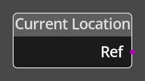

# Current Location 

## Description

{align=left width="25%"}
The *Current Location Node* simply returns a reference to the current location on 
the map for use in other nodes or for storage in a variable for future reference.

 
  
-------

## Ports

Out
: A location reference output port, provides a reference to the current location on 
  the map.

