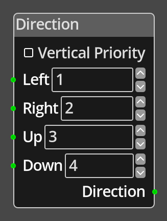

# Direction

## Description

{align=left width="25%"}
The *Direction Node* is used to convert the typical four directional movement
input into a single value representing the primary direction of movement. This
is useful for things like switching sprite animation on
[Objects](../../introduction/terminology.md#object-instances) to show the correct
animation for the movement. If the input suggests a diagonal movement, the
output will be a single value representing the "dominant" axis as defined by
the __Vertical Priority__ parameter, if this is checked, then up/down will be
chosen over left/right if diagonal movement is indicated, if it is not checked,
left/right will get priority.

Note: unlike other nodes with port/parameter pairs, in this node the direction
rows are not port __or__ parameter, both are required. The port is the input,
usually from a [Controller](./controller.md) node, while the parameter
represents the output value that will be used if that direction is determined
to be the dominant direction. In the example here, if only the *right*
controller is non-0, the __Direction__ value output will be 2.

 
  
-------

## Ports

Left 
: An integer input port providing the input value for the left direction, any
  non-0 value will be considered movement in that direction. 

Right 
: An integer input port providing the input value for the right direction, any
  non-0 value will be considered movement in that direction.

Up 
: An integer input port providing the input value for the up direction, any
  non-0 value will be considered movement in that direction.

Down 
: An integer input port providing the input value for the down direction, any
  non-0 value will be considered movement in that direction.

Direction 
: An integer output port, one of the four direction parameter values will be
  output on this port depending on the input data and the __Vertical Priority__
  parameter.

-------

## Parameters

Vertical Priority 
: A boolean value indicating which axis to give priority to if diagonal
  movement is indicated. If checked, up/down will get priority, otherwise
  left/right will.

Left 
: A constant integer value that will be output on the __Output__ port if the 
  inputs indicate movement left.

Right 
: A constant integer value that will be output on the __Output__ port if the 
  inputs indicate movement right.

Up 
: A constant integer value that will be output on the __Output__ port if the 
  inputs indicate movement up.

Down 
: A constant integer value that will be output on the __Output__ port if the 
  inputs indicate movement down.

None
: A constant integer value that will be output on the __Output__ port if none
  of the inputs indicate any movement.
