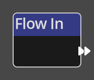

# Flow In

## Description

{align=left width="25%"}
The *Flow In Node* is only used in [Sub Graphs](../../concepts/logic.md#subgraphs). 
It marks the entrypoint for a flow contained in a sub graph. When a sub graph is used
in another flow, this is the point that the execution continues when entering
the sub graph node. 

 
  
-------

## Ports

Flow Out
: The flow for the sub graph will begin with the node connected to this port.
  The Flow Out nodes acts in a similar manner to __Trigger__ nodes, in that it has
  no input flow, as it defines the entrypoint to a sub graph flow.

