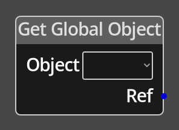

# Get Global Object

## Description

{align=left width="25%"}
The *Get Global Object Node* is used to get an [Object
Reference](../../introduction/terminology.md#objects) to a global object for
use further down the graph in other nodes that accept a *Ref* input. This
allows you to directly affect global objects, moving them, etc.

 
  
-------

## Ports

Ref 
: An Object Ref output port that will provide the reference to the requested
  global object.

-------

## Parameters

Object 
: A dropdown selector that will list all the currently available global objects.
  The value selected will dictate which Ref is returned.

