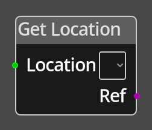

# Get Location

## Description

{align=left width="25%"}
The *Get Location Node* takes an integer value on the __Location__ port and returns
a reference to the location with that index on the map. The map editor displays the
location index in the top left corner of each location.

 
  
-------

## Ports

Location 
: An integer input port used to provide the index of the location to get a reference to.

Ref
: A location reference that points to the given location on the map.

-------

## Parameters

Location 
: A constant value for the location index. The user will be able to choose from a drop
  down list of the existing location names, which will be stored internally as an index,
  for convenience.

