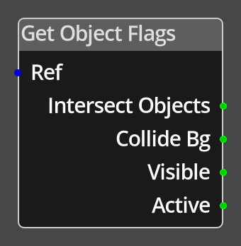

# Get Object Flags

## Description

{align=left width="25%"}
The *Get Object Flags Node* allows the user to query the various [flags](../../object_flags.md)
on an object in the game. As the flags on an object are represented as bits in a larger value, 
the actual number returned is the value of that bit in the flags, as detailed below for each 
output port.

 
  
-------

## Ports

Ref 
: An object reference port that provides a reference to the object to query the flags on.
  If this is not connected, and the logic is on an object, the current object will be
  used.

Intersect Objects
: The value of the intersect objects flag. This is bit 2, if the flag is set the result
  will be 4.

Collide Bg
: The value of the collides with background flag. This is bit 1, if the flag is set the result
  will be 2.

Visible
: The value of the visible flag. This is bit 3, if the flag is set the result
  will be 8.

Active
: The value of the active flag. This is bit 4, if the flag is set the result
  will be 16.

