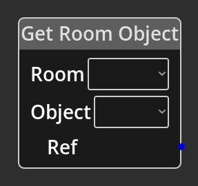

# Get Room Object

## Description

 {align=left}
 The *Get Room Object Node* is used to get an [Object
 Reference](../../introduction/terminology.md#objects) to an object in a room for
 use further down the graph in other nodes that accept a *Ref* input. This
 allows you to directly affect room objects, moving them, etc.

 
  
-------

## Ports

Ref 
: An Object Ref output port that will provide the reference to the requested
  global object.

-------

## Parameters

Room 
: A dropdown selector that will list all the currently available rooms.
  When a room is selected, the contents of the __Object__ selector will update
  to list the object references in that room.

Object 
: A dropdown selector that will list all the currently available objects in the
  selected room. The value selected will dictate which Ref is returned.

