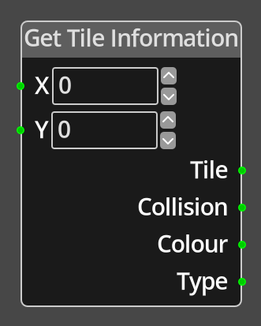

# Get Tile Information 

## Description

{align=left width="25%"}
The *Get Tile Information Node* takes input values X and Y in tile coordinates
and provides back information about the tile at that location in the room tilemap.

!!! note
    This tile only works for the room tilemap, not the screen tilemap.

 
  
-------

## Ports

X 
: An integer input port used to provide the X value of the tile coordinate.

Y 
: An integer input port used to provide the Y value of the tile coordinate.

Tile
: An integer output port, providing the tile number at the specified coordinates 
  if there is a tile there. If there is no tile, the output value with be -1.

Collision
: An integer output port providing the collision flags at the specified coordinates. 
  The value is a bit field representing the sides of the tile that are marked as
  preventing object movement. See [collision](../../concepts/collision.md).

Colour
: An integer output port providing the colour information at the specified
  coordinates. The colour is a combination of ink, paper and bright data as
  described in [colour](../../concepts/colour.md).

Type
: An integer output port providing the custom type of the tile at the specified
  coordinates. If there is no tile at the specified location, the output value will
  be 0. See [tilemaps](../../concepts/tilemaps.md) for details of tile types.

-------

## Parameters

X 
: A constant integer value for the X coordinate, used when the __X__ port is not
  connected.

Y 
: A constant integer value for the Y coordinate, used when the __Y__ port is not
  connected.

