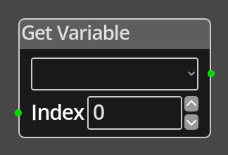

# Get Variable

## Description

{align=left width="25%"}
The *Get Variable Node* is used to get the integer value of a variable on
whatever the current logic graph is running, i.e. a
[Screen](../../introduction/terminology.md#screens), a
[Room](../../introduction/terminology.md#room-types), an
[Object](../../introduction/terminology.md#object-types), or the 
[Global Logic](../../introduction/logic/logic.md#global-logic).

It's important to understand that, in the case of
[rooms](../../introduction/terminology.md#room-types) and
[objects](../../introduction/terminology.md#object-types) the value being accessed
is the value for the chosen variable in the 
[Object Instance](../../introduction/terminology.md#object-instances) or
[Location](../../introduction/terminology.md#locations), that is running the 
logic code, each instance has its own copy of the variables, they are 
independent.

 
  
-------

## Ports

*Output* 
: An integer output port that will provide the value of the chosen variable.

Index
: An integer value for choosing which element in an Array variable to query. If the
  variable being accessed is not an Array variable, this parameter is ignored.

-------

## Parameters

*Variable*
: A dropdown listing the defined variables associated with the current logic graph.

Index
: A constant integer for the Array index if the __Index__ port is not connected.
