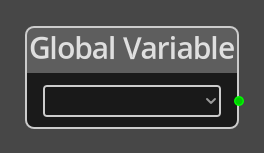

# Global Variable

## Description

{align=left width="25%"}
The *Global Variable Node* is used to get the integer value of a variable on
the global [Logic](../../introduction/terminology.md#logic).

 
  
-------

## Ports

*Output* 
: An integer output port that will provide the value of the chosen variable.

Index
: An integer value for choosing which element in an Array variable to change. If the
  variable being accessed is not an Array variable, this parameter is ignored.

-------

## Parameters

*Variable*
: A dropdown listing the defined variables associated with the global logic graph.

Index
: A constant integer for the Array index if the __Index__ port is not connected.
