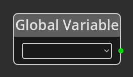

# Global Variable

## Description

{align=left}
The *Global Variable Node* is used to get the integer value of a variable on
the global [Logic](../../introduction/terminology.md#logic).

 
  
-------

## Ports

*Output* 
: An integer output port that will provide the value of the chosen variable.

-------

## Parameters

Variable 
: A dropdown listing the defined variables associated with the global logic graph.

