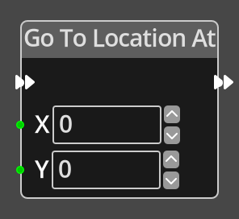

# Go To Location At

## Description

{align=left width="25%"}
The *Go To Location At Node* takes input values X and Y that specify a position 
on the map and will change to the [Location](../../introduction/terminology.md#locations)
at that point on the map if there is one. If there is no location at the specified
coordinates, nothing happens.

 
  
-------

## Ports

Flow In
: In order for this node to perform its operation, it must be connected into an
  active flow using this input port. The flow will ultimately originate at a
  __Trigger__ node but can come from the __Flow Out__ port of any other flow
  node.

Flow Out
: A node connected to the __Flow Out__ port will be executed in sequence
  following the completion of this node's operation.

X 
: An integer input port used to provide the X value of the map coordinate.

Y 
: An integer input port used to provide the Y value of the map coordinate.

-------

## Parameters

X 
: A constant integer value for the X coordinate, used when the __X__ port is not
  connected.

Y 
: A constant integer value for the Y coordinate, used when the __Y__ port is not
  connected.

