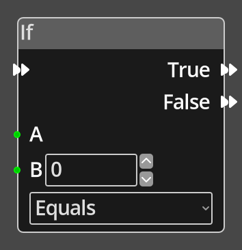

# If 

## Description

{align=left width="25%"}
The *If Node* performs a comparison between two input values and 
follows one of two flows depending on the result of the comparison.

 
  
-------

## Ports

Flow In
: In order for this node to perform its operation, it must be connected into an
  active flow using this input port. The flow will ultimately originate at a
  __Trigger__ node but can come from the __Flow Out__ port of any other flow
  node.

True
: A node connected to the __True__ port will be executed in sequence if the
  result of the comparison succeeds.

False
: A node connected to the __False__ port will be executed in sequence if the
  result of the comparison fails.

A 
: An integer input port used to provide the first value for comparison. 
  This must be connected for the node to operate correctly.

B
: An integer input port used to provide the second value for comparison.

-------

## Parameters

B
: A constant integer value for the B operand, used when the __B__ port is not
  connected.

Comparison
: The type of comparison to perform, this can be any one of "equals", 
  "greater than", "less than", "greater or equal", "less or equal", or
  "not equal".

