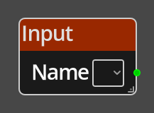

# Input

## Description

{align=left width="25%"}
The *Input Node* represents an input value to a 
[Sub Graph](../../concepts/logic.md#subgraphs). The provided name is used on the 
sub graph node as the name for the input port that provides the value into the
rest of the sub graph flow.

See [Sub Graphs](../../concepts/logic.md#subgraphs) for more information regarding
the use of sub graphs.

 
  
-------

## Ports

Out
: An output port, the value passed into the matching named port on the sub graph
  node will be provided here to the rest of the nodes in the sub graph that need
  it.

-------

## Parameters

Name 
: The name of the port on the sub graph that will represent this input value.

