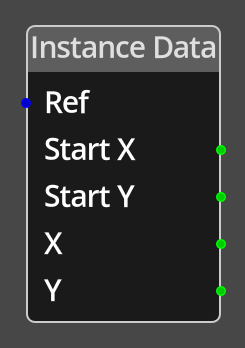

# Instance Data

## Description

{align=left width="25%"}
The *Instance Data Node* provides useful information about the current [Object
Reference](../../introduction/terminology.md#objects) that the logic graph is
running on. This is information that is unique to each reference of the object
type, much like variables, but for accessing common data that all object
references have.

Note: the position data is returned in the appropriate coordinate system for
the object being referenced. A global or dynamic object will return coordinates
in "map" space, a room object will return coordinates in the local space of the
room.

 
  
-------

## Ports

Ref 
: An Object Reference input port that can provide an object that will be used
  to lookup the instance data. If this is not connected and the logic is on
  an [Object](../../introduction/terminology.md#objects), the current object
  will be used instead. If the logic is not on an object, 0 will be returned
  on all output ports.

Start X
: The initial X position of the object, this is constant, and used to reset the 
  object's position at the start of the game.

Start Y
: The initial Y position of the object, this is constant, and used to reset the 
  object's position at the start of the game.

X
: The current X position of the object, this is the live position of the object
  as set by any [Move Object](./move_object.md) nodes, or other nodes that can
  modify an object's position. 

Y
: The current Y position of the object, this is the live position of the object
  as set by any [Move Object](./move_object.md) nodes, or other nodes that can
  modify an object's position. 
