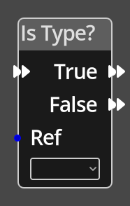

# Is Type?

## Description

{align=left width="25%"}
The *Is Type Node* takes a reference to an object and checks if it uses
the given [object definition](../../concepts/objects.md). It will continue
executing in one of the __True__ or __False__ paths depending on the 
outcome of the test.

 
  
-------

## Ports

Flow In
: In order for this node to perform its operation, it must be connected into an
  active flow using this input port. The flow will ultimately originate at a
  __Trigger__ node but can come from the __Flow Out__ port of any other flow
  node.

Ref 
: An object reference port that provides a reference to the object to check.
  If this is not connected, and the logic is on an object, the current object will be
  used.

True
: A node connected to the __True__ port will be executed in sequence if the
  object uses the specified object definition.

False
: A node connected to the __False__ port will be executed in sequence if the
  object does not use the specified object definition.

