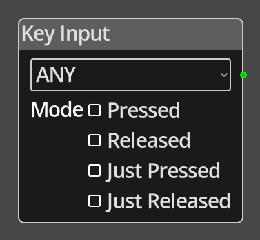

# Key Input

## Description

{width="25%" align=left}
The *Key Input Node* reports on the status of a specific single key, or any
key.

The node reports the status in one of four modes, *Pressed*, *Released*,
*Just Pressed* and *Just Released*. The *Pressed* and *Released* modes will
report continuously while the input is in the appropriate state, either pressed
or not pressed. The *Just Pressed* and *Just Released* will report only for the
frame after the input changes to the appropriate state, pressed or released.
For example, *Just Pressed* will report only once when the player presses the
key or joystick control, commonly used for fire actions, it will not report
again until the player releases that input and then activates it again.

 
  
-------

## Ports

*Output* 
: An integer output port that will report the result of checking the state of the
  key based on the mode. If node is configured to check for a specific key, the
  output will be 0 or 1. If the node is configured to check for any key, the
  output will be the [Keycode](../../introduction/terminology.md#keycodes) of 
  the first key that is found to be in the configured state, *Pressed*, 
  *Released*, *Just Pressed* or *Just Released*.

-------

## Parameters

*Key* 
: A dropdown list of keys you can check for, or "ANY" to check for any key.

Mode
: Define the mode of operation between *Pressed*, *Released*, *Just Pressed* and
  *Just Released*. See above for an explanation of the difference between the 
  modes.
