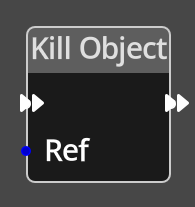

# Kill Object

## Description

{align=left width="25%"}
The *Kill Object Node* is used to remove a dynamic object that was created with
the [Spawn Object](./spawn_object.md) node. 

!!! note
    It is not possible to kill map or room objects, only those created with the
    [Spawn Object](./spawn_object.md) node.

 
  
-------

## Ports

Flow In
: In order for this node to perform its operation, it must be connected into an
  active flow using this input port. The flow will ultimately originate at a
  __Trigger__ node but can come from the __Flow Out__ port of any other flow
  node.

Flow Out
: A node connected to the __Flow Out__ port will be executed in sequence
  following the completion of this node's operation.

Ref 
: An object reference port that provides a reference to the object to check.
  If this is not connected, and the logic is on an object, the current object will be
  used.

