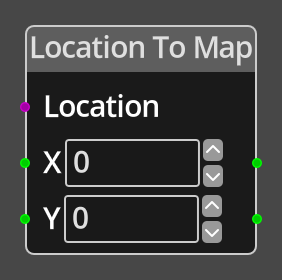

# Location To Map

## Description

{align=left width="25%"}
The *Location To Map Node* takes input values X and Y that define a position 
in the room coordinates of a specified [Location](../../introduction/terminology.md#locations) 
and converts the position into map coordinates.

This is particularly useful for positioning a map level object so that it is at a 
chosen point within a location.

 
  
-------

## Ports

Location 
: A location reference port that provides a reference to the location that the
  provided coordinates are relative to. If not connected, and the logic is on
  a location, the current location will be used.

X 
: An integer input port used to provide the X value of the location coordinate.

Y 
: An integer input port used to provide the Y value of the location coordinate.

-------

## Parameters

X 
: A constant integer value for the X coordinate, used when the __X__ port is not
  connected.

Y 
: A constant integer value for the Y coordinate, used when the __Y__ port is not
  connected.

