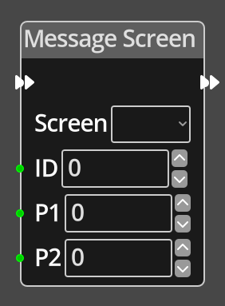

# Message Screen

## Description

{align=left width="25%"}
The *Message Screen Node* sends a message to specified screen. The screen logic should 
have an [On Message](./on_message.md) node correctly configured to handle the message, 
otherwise it will have no effect.

The ID of the message is used to choose which [On Message](./on_message.md)
flow will handle the message, and the optional parameters P1 and P2 are passed
to the message handler to provide additional information that can be arbitrarily
defined by the game designer.

 
  
-------

## Ports

Flow In
: In order for this node to perform its operation, it must be connected into an
  active flow using this input port. The flow will ultimately originate at a
  __Trigger__ node but can come from the __Flow Out__ port of any other flow
  node.

Flow Out
: A node connected to the __Flow Out__ port will be executed in sequence
  following the completion of this node's operation.

ID 
: An integer input port used to provide ID of the message, this controls which
  flow on the global object will handle the message, only [On Message](./on_message.md)
  flows with a matching ID will be executed.

P1 
: An integer input port used to provide an arbitrary parameter to the handler, the
  purpose of which is defined by the game designer.

P2 
: An integer input port used to provide an arbitrary parameter to the handler, the
  purpose of which is defined by the game designer.

-------

## Parameters

Screen
: The screen to send the message to. A dropdown will show a list of available
  screens to select from.

ID 
: A constant integer value for the message ID, used when the __ID__ port is not
  connected.

P1 
: A constant integer value for the optional P1 parameter, used when the __P1__ 
  port is not connected.

P2 
: A constant integer value for the optional P2 parameter, used when the __P2__ 
  port is not connected.

