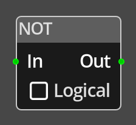

# Not

## Description

{align=left width="25%"}
The *Not Node* takes a single input of type integer and performs either a logical
or bitwise NOT operation on it before providing the result on the *Out* port.

If the *Logical* flag is set, the node will consider any non-zero value as "true" 
and 0 as false, and output a 1 if the input is false otherwise 0.

If the *Logical* flag is clear, the node will peform a bitwise NOT on the  
16 bit integer input, resulting in a 16 bit integer where each bit is set 
if the bit is unset in the input.

 

-------

## Ports

n
: The input value, must be linked for the node to be operational and
  can only be connected to sources that provide an integer value, such as
  [Get](get_variable.md).

Out  
: The output of the node.

-------

## Parameters

*Logical*
: This defines whether the NOT is to be performed as a logical or bitwise NOT. 

