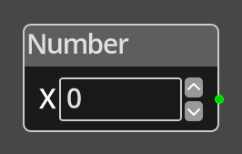

# Number

## Description

{align=left width="25%"}
The *Number Node* simply provides a constant fixed number to be used as the
input to other nodes. 

While most nodes offer constant parameters for integer input ports, this node
can be useful when using the same input value for multiple nodes, as it allows
you to change the value in one place rather than remembering to change it
in multiple places, but still have the size and performance benefits of a
constant value instead of a variable.

 
  
-------

## Ports

*Out* 
: An integer output port that provides the specified constant value.

-------

## Parameters

*Value* 
: A constant integer value to provide.

