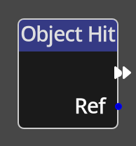

# Object Hit

{align=left width="25%"} 
The *Object Hit Node* is a specific type of *Node* called a __Trigger__. A
trigger *Node* is an entrypoint into a flow in the Kwyll logic. The *Object
Hit* trigger is triggered automatically when any object that is configured to
detect intersections with other objects is moved into a position where it
intersects another that is also flagged to detect intersections with other
objects. Any defined *Object Hit* flows on both objects involved in the
intersection will be triggered.

 

-------

## Ports

Flow Out
: As with all trigger nodes, an *Animation Event Node* has only a single flow
  port on the output side. There is no input flow to a trigger node as it is the
  origin of a flow.

Ref
: An object reference output port that provides a reference to the other object
  involved in the intersection.

