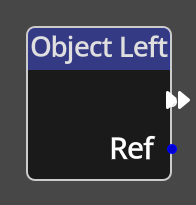

# Object Left

## Description

{align=left width="25%"} 
The *Object Left Node* is a specific type of *Node* called a __Trigger__. A
trigger *Node* is an entrypoint into a flow in the Kwyll logic. The *Object
Left* trigger is triggered automatically when two objects that were previously
intersecting move into positions that mean they are no longer intersecting.

 

-------

## Ports

Flow Out
: As with all trigger nodes, an *Animation Event Node* has only a single flow
  port on the output side. There is no input flow to a trigger node as it is the
  origin of a flow.

Ref
: An object reference output port that provides a reference to the other object
  involved in the intersection.

