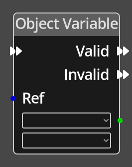

# Object Variable

## Description

{align=left width="25%"}
The *Object Variable Node* is used to get the integer value of a variable on
a given [Object](../../introduction/terminology.md#objects).

 
  
-------

## Ports

Flow In
: In order for this node to perform its operation, it must be connected into an
  active flow using this input port. The flow will ultimately originate at a
  __Trigger__ node but can come from the __Flow Out__ port of any other flow
  node.

Valid
: A node connected to the __Valid__ port will be executed in sequence if the
  specified object is using the correct Object Definition.

Invalid
: A node connected to the __Invalid__ port will be executed in sequence if the
  specified object is not using the correct Object Definition.

Ref 
: An object reference port that provides a reference to the object to check.
  If this is not connected, and the logic is on an object, the current object will be
  used.

*Output* 
: An integer output port that will provide the value of the chosen variable.

-------

## Parameters

*Variable*
: A dropdown listing the defined variables associated with the specified location.

*Object Definition*
: A dropdown listing the available object definitions. Only if the specified object
  uses the object definition chosen will the variable output be valid.

