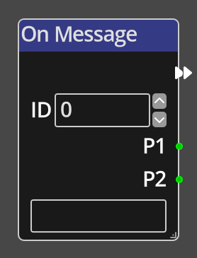

# On Message

## Description

{align=left width="25%"}
The *On Message Node* is a specific type of *Node* called a __Trigger__. A
trigger *Node* is an entrypoint into a flow in the Kwyll logic. The *On
Message* trigger is triggered manually within another flow by using the
[Message Room](./message_room.md), [Message Object](./message_object.md),
[Message Screen](./message_screen.md) or [Message Global](./message_global.md)
nodes.  

A message consists of 3 parts, an ID and two optional parameters. The send
message nodes have ports and parameters to set these values which control
how this flow responds. The ID sent must match the ID defined in this flow for
the flow to run. The parameters are typically used to control what the flow
does. For example, a flow on a room that opens a door might take the side of
the room that the door is on in P1 and the type of door in P2.

The text field at the bottom of this node can be used to give a name to this
message flow, it is used for informational purposes only, as a reminder to the
designer of what this flow is responsible for.

 

-------

## Ports

Flow Out
: As with all trigger nodes, an *On Message Node* has only a single flow port
  on the output side. There is no input flow to a trigger node as it is
  the origin of a flow. This flow is only followed if the ID of the message sent 
  matches the ID of this flow.

P1
: The value of the first parameter sent with the message, the *Message* nodes
  have ports and parameters to define this, so each use of the message flow 
  can have different results based on the information passed in.

P2
: The value of the second parameter sent with the message, the *Message* nodes
  have ports and parameters to define this, so each use of the message flow 
  can have different results based on the information passed in.

-------

## Parameters

ID 
: *On Message Nodes* have a single additional parameter, __ID__. This is the 
  message ID that the flow will respond to. It is sent as part of the *Message*
  send nodes. Using this ID it is possible to have multiple flows on an object,
  room, screen or in the global logic that respond to different messages,
  multiple "functions" if you will.

