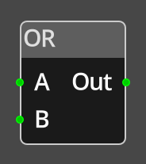

# Or

## Description

{align=left width="25%"}
The *Or Node* takes two inputs of type integer and compares them with 0. If
either or both are not 0, the output will be 1, if both are 0, the output will
be 0. 

This is useful to combine checks, in particular with the [Compare](compare.md) node.

## Ports {: style="clear:left" }

### A and B

The two input values, they must be linked for the node to be operational and
can only be connected to sources that provide an integer value, such as
[Get](get_variable.md).

### Out

The output of the node, will be either 1 or 0 depending on the result of the
compare.

