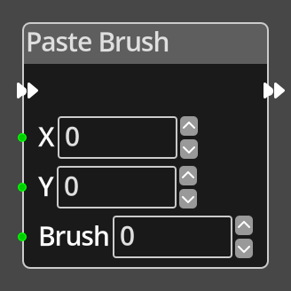

# Paste Brush

## Description

{align=left width="25%"}
The *Paste Brush Node* takes input values X and Y that specify a position 
on the room tilemap in tile coordinates and will paste the contents of the 
[brush](../../introduction/terminology.md#brushes) at the specified index into 
that location on the tilemap.

!!! note
    Pasting brushes only applies to 
    [Room](../../introduction/terminology.md#room-types) tilemaps.

 
  
-------

## Ports

Flow In
: In order for this node to perform its operation, it must be connected into an
  active flow using this input port. The flow will ultimately originate at a
  __Trigger__ node but can come from the __Flow Out__ port of any other flow
  node.

Flow Out
: A node connected to the __Flow Out__ port will be executed in sequence
  following the completion of this node's operation.

X 
: An integer input port used to provide the X value of the tilemap coordinate.

Y 
: An integer input port used to provide the Y value of the tilemap coordinate.

Brush
: An integer input port used to specify the index of the brush to paste at the 
  given position.

-------

## Parameters

X 
: A constant integer value for the X coordinate, used when the __X__ port is not
  connected.

Y 
: A constant integer value for the Y coordinate, used when the __Y__ port is not
  connected.

Brush 
: A constant integer value for the brush index, used when the __Brush__ port is not
  connected.

